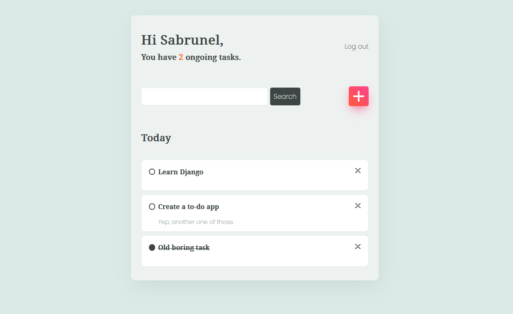

## Project overview

Yep, that's another **to-do app**.

The concept isn't exactly new around here, but as a first project with Django, I figured I'd start with something both easy and *useful*.

Judging by the pile of notebooks and random sheets currently sitting on my desk, a to-do list is a pretty solid pick.

**The app currently supports:**
- user registration and login,
- creating, editing and deleting tasks,
- searching for a given task.

Tasks are listed based on their priority and completion status, so that the most important ones are on top of the list (and completed one at the bottom).

**Here's a glimpse of what it looks like:**

### Requirements

Requirements for using this code are available in the `requirements.txt` file.

Each package can be installed using the Pip command, or in conda with:

`conda create --name <env> --file requirements.txt`

### Run the app (locally)

Open the command line and navigate to the folder containing `manage.py`

First, create and update the sqlite3 database with:

`python manage.py migrate`

Then, run the development server with:

`python manage.py runserver`

## What I learned

- Set up a Django project and apps to split functionalities,
- Perform basic CRUD operations and user authentication through Django's class-based views, URLs and templates,
- Speaking of which, hello there my new HTML and CSS friends!

## What's next?

Neat functionalities I would like to add are:
- setting a due date for task completion,
- splitting daily and weekly tasks.

